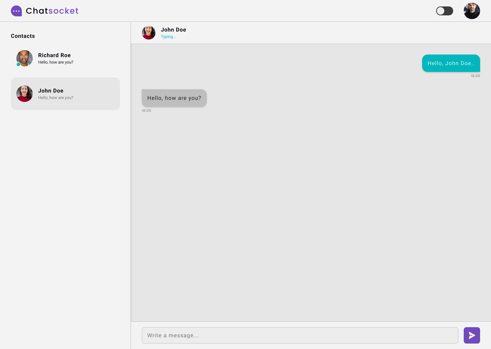

  <picture>
    <source media="(prefers-color-scheme: dark)" srcset=".github/logo-dark.svg" />
    <source media="(prefers-color-scheme: light)" srcset=".github/logo-light.svg" />
    
  </picture>

---

  <a href="#-tecnologias">Tecnologias</a>&nbsp;&nbsp;&nbsp;|&nbsp;&nbsp;&nbsp;
  <a href="#-projeto">Projeto</a>&nbsp;&nbsp;&nbsp;|&nbsp;&nbsp;&nbsp;
  <a href="#-pré-requisitos">Pré Requisitos</a>&nbsp;&nbsp;&nbsp;|&nbsp;&nbsp;&nbsp;
  <a href="#-rodando-a-aplicação">Rodando a Aplicação</a>&nbsp;&nbsp;&nbsp;|&nbsp;&nbsp;&nbsp;
  <a href="#autor">Autor</a>

  <picture>
    <source media="(prefers-color-scheme: dark)" srcset=".github/project-dark.png" />
    <source media="(prefers-color-scheme: light)" srcset=".github/project-light.png" />
    
  </picture>

## 🚀 Tecnologias

Esse projeto foi desenvolvido com as seguintes tecnologias:

Backend

- [Node.js](https://nodejs.org/en/)
- [Typescript](https://www.typescriptlang.org/)
- [Express](https://expressjs.com/)
- [Docker](https://www.docker.com/)
- [Jest](https://jestjs.io/)
- [Socket.io](https://socket.io/)
- [MongoDB](https://www.mongodb.com/)

Frontend

- HTML e CSS
- JavaScript
- [Node.js](https://nodejs.org/)
- [Vite](https://vitejs.dev/)
- [Socket.io](https://socket.io/)

## 💻 Projeto

O Chatsocket é uma aplicação de comunicação através de mensagens de texto.

O intuito deste projeto foi estudar a comunicação através de Websocket, foi uma experiência incrível e muito gratificante quando a comunicação começou a funcionar e trocar mensagens entre servidor e cliente.

## 📥 Pré-requisitos

Antes de começar, você vai precisar ter instalado em sua máquina as seguintes ferramentas: [Git](https://git-scm.com/), [Node.js](https://nodejs.org/en/), [Docker](https://www.docker.com/), [Yarn (Opcional)](https://yarnpkg.com/).

## 🎲 Rodando a Aplicação

1. Clone o repositório.
2. Acesse o diretório do projeto.
3. Acesse os diretórios `server` e `web` para verificar como executar cada um deles.

## Autor

 

Feito com 💜 por Jordane Chaves